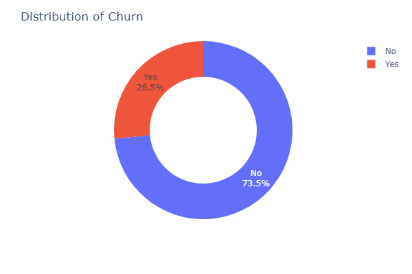
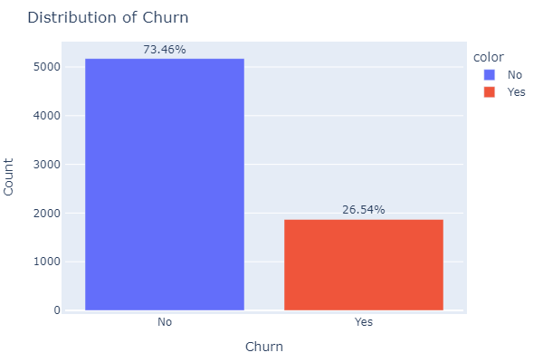
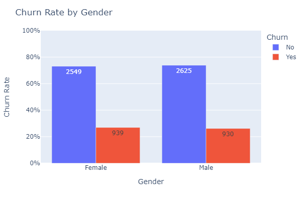
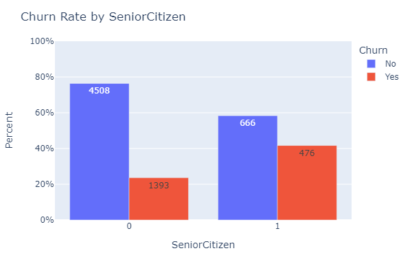
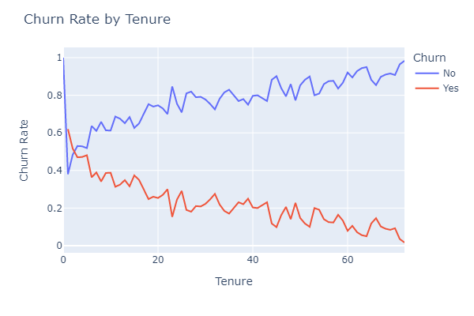
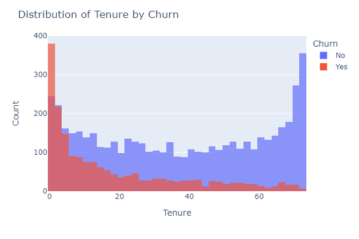

## Telecom Churn Analysis
This repository contains the code for analyzing telecom churn rate. The aim of this project is to predict whether a customer will churn or not based on various features.

## Table of Contents
* Libraries Used
* Load Data
* Exploratory Data Analysis
* Data Preprocessing
* Machine Learning
## Libraries Used
* pandas
* numpy
* seaborn
* matplotlib
* plotly
* shap
* scikit-learn
* xgboost

## Load Data
The dataset used for this project is the Telco-Customer-Churn.csv file. This dataset was source from kaggle: https://www.kaggle.com/blastchar/telco-customer-churn. It contains information about customers who have either churned or not churned. The dataset includes features such as customer demographics, account information, and services that each customer has signed up for.

## Exploratory Data Analysis
The following tasks were performed in the exploratory data analysis:

* Checked for data types and null values.
* Converted TotalCharges to float and filled in missing values.
* Obtained descriptive statistics.
* Dropped the customerID column.
* Plotted churn rate distribution.

* Calculated churn percentage.

* Grouped the data by gender and churn and counted the number of customers in each group.

* Calculated the churn rate for each gender and created a bar chart.

* Created a function to plot the churn rate by different categories such as PaymentMethod, Partner, Dependents, etc.

* Calculated the churn rate by tenure and created a line and histogram chart

